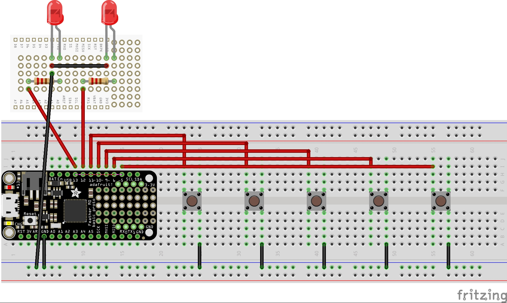
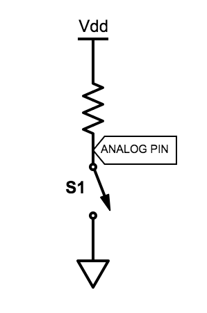
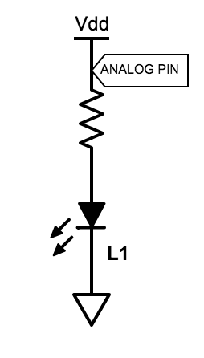
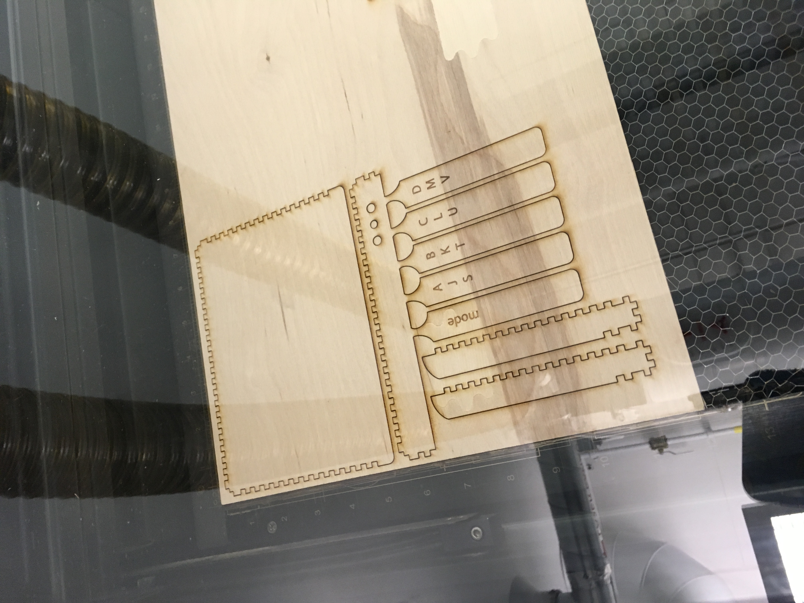
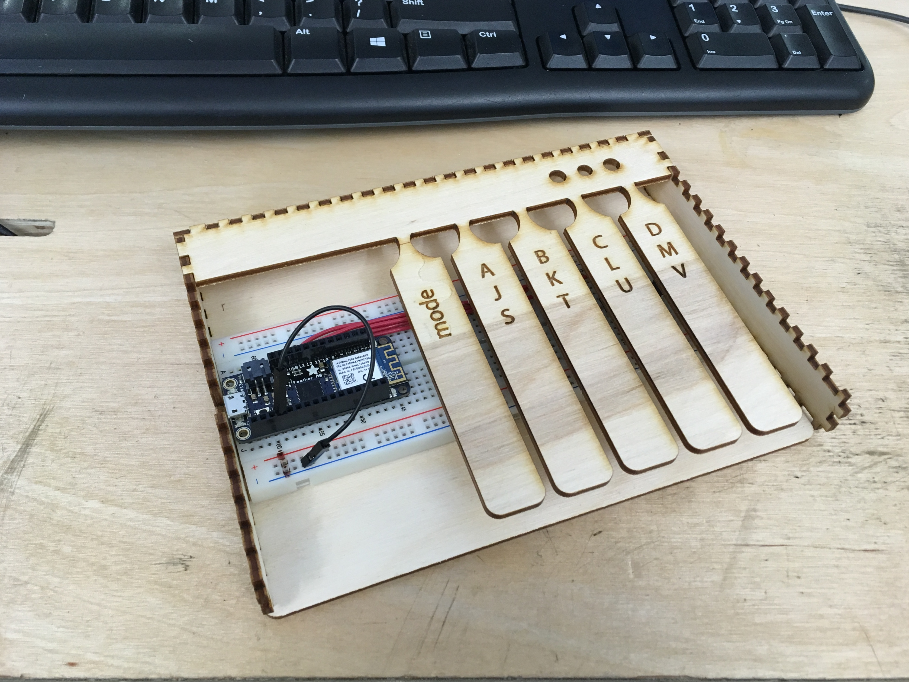
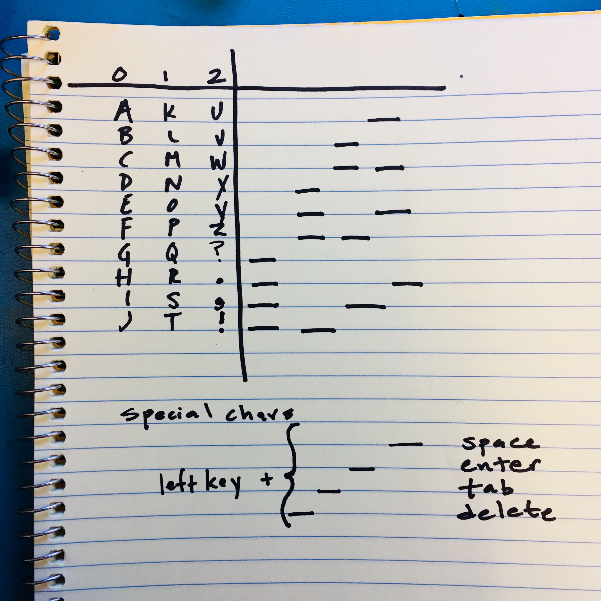

# HW2: Chorded Keyboard
Paige Plander & Emily Huynh

IDD Summer 2018

## Introduction
Conventional QWERTY keyboards, even on touchscreen phones, require two hands for efficient operation. Chorded keyboards (also known as a keyset) were [introduced in 1968](https://www.youtube.com/watch?v=t5WUBweOZA4) by Douglas Engelbart, uniquely requiring only one hand.


The original chorded keyboard based key mappings on the number the letter corresponded to (for example, A is 1 and Z is 26). Each key from left to right was equivalent to 1, 2, 4, 8, 16; pressing two keys at once would add these values together in order to map to the correct letter in the alphabet. The act of pressing two keys at once to yield a different result is where the "chorded" namesake comes from.

## Hardware
### Circuit
The circuit consists of five switches and an Adafruit Feather M0. Switches were connected to pins 5, 6, 9, 10, and 11 on the Feather on one terminal, and ground on the other terminal. When the user presses the switch, the switch will be registered as ```LOW``` on the microcontroller because the two terminals on the switch get connected, and the 3.3V is pulled down to ground. Without any presses, the state is regularly registered as ```HIGH```, and internal pull-up resistors are used.

The LEDs that are used to display the current group status (see Software: Mapping) were connected to pins 12 and 13 on the microcontroller. Pressing a preset switch (the leftmost key) would toggle the grouping, and thus toggle which LED was on with the use of ```digitalWrite(PIN, 0)``` to turn the last group state-associated LED off, and the next grouping on with ```digitalWrite(PIN,1)```. Two LEDs are used to represent three modes; the left LED represents Mode 1, the right LED represents Mode 2, and both LEDs represent Mode 3.





### Housing
The housing is made from 1/8'' thick Plywood. Designs were laser cut using a Universal Laser System. Although several cuts were made in order to get the correct height so the keys would lie directly on top of the buttons. Three holes were cut out for LED display to indicate the current grouping, and a notch on the side was cut out for the microUSB connection to the microcontroller.



## Software
### Debouncing
In order to correctly register key presses, debouncing the buttons was required in order to provide a smooth interface. Debouncing was done by setting a variable ```DEBOUNCE_TIME``` to 60 ms. Debouncing often only requires 5-10 ms, but extra time was added to help with registering simultaneous key presses. 

After waiting for the set debounce time, presses were registered as valid and stored in an array where they could be accessed for mapping.

### Mapping
Instead of using the math-based mapping of the original chorded keyboard, we decided to create specific mappings to different key patterns. The alphabet was split into groups of 3: A-J, K-T, and U-Z. Accessing a key from any of these groups would require toggling the "step" button on the leftmost side to the respective group. The remaining combinations were used for punctuation characters (? . , and !). 

Once the correct group was selected, the user then has a choice of 8-9 different letters to choose from. While the first four letters could be chosen with one key press, the remaining 5 required two different keys in order to select the correct letter. For commonly used special characters, the left key is used. These patterns can be found below.



## Final Product Demo
