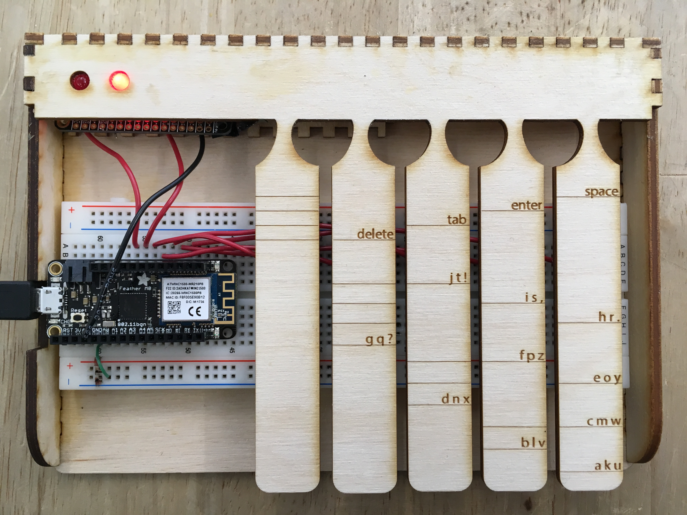

# HW2: Chorded Keyboard
Paige Plander & Emily Huynh

IDD Summer 2018

## Introduction
Conventional QWERTY keyboards, even on touchscreen phones, require two hands for efficient operation. Chorded keyboards (also known as a keyset) were [introduced in 1968](https://www.youtube.com/watch?v=t5WUBweOZA4) by Douglas Engelbart, uniquely requiring only one hand.


The original chorded keyboard based key mappings on the number the letter corresponded to (for example, A is 1 and Z is 26). Each key from left to right was equivalent to 1, 2, 4, 8, 16; pressing two keys at once would add these values together in order to map to the correct letter in the alphabet. The act of pressing multiple keys at once to yield a different result is where the "chorded" namesake comes from.

## Hardware
### Circuit
The circuit consists of five switches, an Adafruit Feather M0, and two LEDs. Switches were connected to pins 9-13 on the Feather on one terminal, and ground on the other terminal. When the user presses the switch, the switch will be registered as ```LOW``` on the microcontroller because the two terminals on the switch get connected, and the 3.3V is pulled down to ground. Without any presses, the state is regularly registered as ```HIGH```, and internal pull-up resistors are used.

The LEDs that are used to display the current step (see Software: Mapping) were connected to pins 5 and 6 on the microcontroller. Pressing a preset switch (the leftmost key) would toggle the grouping, and thus toggle which LED was on with the use of ```digitalWrite(PIN, 0)``` to turn the last group state-associated LED off, and the next grouping on with ```digitalWrite(PIN,1)```. Two LEDs are used to represent three modes; the left LED represents Mode 1, the right LED represents Mode 2, and both LEDs represent Mode 3.


### Housing
The housing is made from 1/8'' thick Plywood. Designs were laser cut using a Universal Laser System. Three holes were cut out for LED display to indicate the current grouping, and a notch on the side was cut out for the microUSB connection to the microcontroller.

Below are a few of our early housing designs.


Our final design included a key for every letter in the alphabet and special character that can be used on the keyboard. By following the lines from right to left, beginning at the character you'd like to input, you can see which keys need to be pressed down to make each combination. 



## Software
### Debouncing
In order to correctly register key presses, debouncing the buttons was required in order to provide a smooth interface. Debouncing was done by setting a variable ```DEBOUNCE_TIME``` to 20 ms. Debouncing often only requires 5-10 ms, but extra time was added to help with registering simultaneous key presses. We found that setting this delay right as the first key press was detected and after all buttons were released worked best. Presses were then registered in an array to be decoded as characters. 

### Mapping
Though we borrowed some of the shape progressions from the original Engelbart keyboard, we reduced the number of key press combinations by splitting the alphabet into groups of 3, and reusing the same key patterns within each group. Pressing the "step" key (leftmost key), the user can switch between these three sets, which are listed here:
   
   1. A - J
   2. K - T
   3. U - Z and punctuation characters (? . , and !)
   
We also included unique chords for commonly used special characters (delete, tab, enter, and space) that can be accessed regardless of which step the program is in. Though this can take time to get used to, we included LEDs to let the user know which step they are in at all times, and visual representations of each character's chord on the keyset itself. These patterns can be found below.


To translate the data from the pins to our character mapping, we used a function to represent the list's state as a unique number. This function scanned through the list of input pins, adding them in as increasing powers of twos. We could then use this id number to return the appropriate letter in our mapping.

### Keyboard Functions
To input text outside of the serial monitor, we used the [Arduino Keyboard library](https://www.arduino.cc/reference/en/language/functions/usb/keyboard/).

## Final Product Demo
This video shows the prototype being used to type "hello world!".

https://youtu.be/BeIKeHseZs4

## Reflection
We had little to no experience in most of the tasks we had to do to complete for this project (which was cool!), so a lot of time was spent fixing mistakes and learning how to use the design software we were working with. Getting the laser cut casing to fit perfectly over the keys took many attempts, and we spent a lot of time debugging the debouncing code. The most tedious part of the hardware implementation was finding LEDs that worked, but otherwise didn't take too much time overall. If we had more time, we would have liked to prototype different key mappings and physical key types, and come up with a way to fit the entire circuit behind the keyset. 

